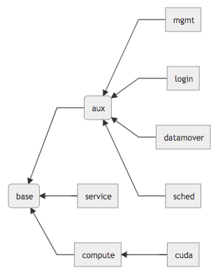

# xCAT osimage guide

## Netbooted Image Overview
This documents the MSC xCAT image configuration. The tools used are documented in the xCAT documentation. To get information about manipulating xCAT objects, you can look [here](https://xcat-docs.readthedocs.io/en/stable/guides/admin-guides/basic_concepts/xcat_object/index.html). To get information about osimages in xCAT you can look [here](https://xcat-docs.readthedocs.io/en/stable/guides/admin-guides/basic_concepts/xcat_object/osimage.html). 

The images we use in cascade are netbooted. So each image is prebuilt and compacted on the director and are sent over the network to the node when it boots. As little configuration is done to the nodes as possible during runtime, but some configuration is done after the node boots in the postboot scripts. 

Most of the configuration is stored in the [hpcs4-xcat repository](https://gitlab.emsl.pnl.gov/msc_ops/hpcs4-xcat). Whenever a change is made to the main branch, the files are synced to the Cascade director in the /install directory. Correspondingly, the development branch syncs to the Felicia director.

The configuration for the netbooted images are stored in the `/custom/netboot/centos/` directory. xCAT then uses the files in this directory by using osimage objects stored in its database. More details about our osimage configuration are in the [Osimage Details](#osimage-details) section.

## Image Hierarchy
In order to reduce the complexity and inconsistency between the images that are run in Cascade, we have started using a hierarchy of profiles. Each of the profiles inherits from the base profile and/or from the aux profile. The current profile structure is below.



## Modifying an image

### Installing Packages
Make sure the package is available in the site repostiries. Once it is, add it to the package list that is associated with the profile that is most appropriate within the image hierarchy, and commit that change to the git repository. Making a comment about why it is being added is helpful (i.e. ticket number, issue number, requested by someone, etc.).

After it has been added to the package list, the image needs to be [rebuilt and deployed](#building--deploying-an-image).

### Copying Files
We use syncfiles to copy files into the osimages. Syncfiles does not follow the profile hierarchy specified above. It will require another refactor in order to get them cleaned up and added. Until that time, all images that need files added to them need to be specified in their appropriate synclist. 

To sync a file into an image, it first needs to be made available on the director node. Most of the files are stored in the hpcs4-xcat repository in the `/custom/commonfiles/` directory. Files outside the repository can be specified as well, for example system files (/etc/host) or encrypted files other systems.

Once the file is available on the director, add an entry to the appropriate profile synclist file. It needs to include the full path on the director, so if the file was installed in the git repository, you need to make sure to include `/install/custom/` before the file.

Once the entry is in place, [rebuild the image](#building--deploying-an-image). Syncfiles happen at the end of the image build process and during system boot in the postscripts, so they will not be available during package install, postinstall, or if you are inspecting the image manually.

### Scripting Changes
If more complicated changes are needed, either a postinstall script or a postscript can be used. Each different type executes in a different environment at a different time.

* postinstall - executes at image build time in the context of the director. If it needs to manipulate the image being built, it needs to chroot into the build directory first.
* postscript - executes on the node late in boot process (roughly about when rc.local would be executed if using init). In a diskful image, this would be executed at the tail end of an install before the reboot.
* postbootscript - executes immediately after the postscripts. In a diskful image, this executes after the install reboot.  In our environment, postscripts and postbootscripts are effectively the same thing.

We are trying to use postinstall scripts in order to shorten deploy/boot time and reduce the number of problems that will occur during boot by baking the changes directly into the image. Postscripts are still needed for changes that are dependent on the node that is being deployed (i.e. which computational unit the node is located in) or if a change has to be done at runtime (i.e. saving the running interfaces into the configs). Both types of scripts need to be idempotent since builds can be executed multiple times in each image, and postscripts can be executed by an admin with an `updatenode`.

To create a postinstall, add a new script to the `/custom/netboot/centos/postinstall/available` directory. The postinstall scripts do not execute in the context of the image. So make sure to write or chroot into the directory to modify anything inside the image (it is passed in as the first parameter to the script). To specify which profile executes the postinstall, create a link from the corresponding profile directory in `/custom/netboot/centos/postinstall/{profile}` to the script in the `/custom/netboot/centos/postinstall/available` directory. After everything is committed, [build the image](#building-deploying-an-image) to execute the new script.

The osimage is configured to execute the post install scripts by setting the osimage as follows:
```
chdef -t osimage centos7-x86_64-netboot-compute "postinstall=/install/cascade/custom/netboot/centos/base.postinstall,/install/cascade/custom/netboot/centos/compute.postinstall"
```
Multiple entries allows the images to build on other images.

To create a postscript, add a new script in the `/custom/postscripts/msc/custom` directory (if it doesn't exist create it) and create a link in the `/custom/postscripts/msc/osimage/{osimage}` directory back to the full path of the script to execute. The scripts are executed in alphabetic order, so they should be prepended with a number to indicate the order of execution. Each osimage is configure to execute the directory by setting the postscript as follows

```
chdef -t osimage centos7-x86_64-netboot-compute "postscripts=msc/postscript-exec msc/osimage/centos7-x86_64-netboot-compute"
```


# Building & Deploying an Image

## Building Images
There are two scripts in `/install/custom/netboot/centos` to build the images. They should be run on the director node. To build a single image, use the `makeimage` script and specify the profile. Alternatively, all the images can be built simultaneously by using the `makeallimages` script. After completing all the build steps, the images should be located in the `/install/netboot/centos7/x86_64/` directory. The scripts can be run multiple times to make iterative changes to the image. Fresh images can be built by passing the `--rebuild` to either script. This should be done before being deployed for final production.

## Deploying Images
Since we are using netboot images, it is relatively simple to deploy built images to nodes. To assign a particular image to the node, run 
```
nodeset <noderange> osimage=centos7-x86_64-netboot-<profile>
```
and either reboot the node, or power cycle it with a
```
rpower <noderange> boot
```

# Advanced Topics

## Osimage Details

To get a listing of the osimages, do 

```
$ lsdef -t osimage
centos-es3.0.0-x86_64-install-ddn3  (osimage)
centos7-x86_64-netboot-compute-min  (osimage)
centos7-x86_64-netboot-datamover  (osimage)
centos7-x86_64-netboot-login  (osimage)
centos7-x86_64-netboot-mgmt  (osimage)
centos7-x86_64-netboot-sched  (osimage)
centos7-x86_64-netboot-service  (osimage)
``` 
To inspect each individual image, you can pass the image name to the previous command and it will display all the attributes used to build the image:
```
$ lsdef -t osimage centos7-x86_64-netboot-login
Object name: centos7-x86_64-netboot-login
    exlist=/install/custom/netboot/centos/login.exlist,/install/custom/netboot/centos/aux.exlist
    imagetype=linux
    osarch=x86_64
    osdistroname=centos7-x86_64
    osname=Linux
    osvers=centos7
    otherpkgdir=/install/post/otherpkgs/centos7/x86_64
    otherpkglist=/install/felicia/custom/netboot/centos/login.pkglist,/install/felicia/custom/netboot/centos/aux.pkglist
    permission=755
    pkgdir=https://repo.emsl.pnl.gov/repo/el7-hpc-test/
    pkglist=/install/felicia/custom/netboot/centos/base.pkglist
    postinstall=/install/felicia/custom/netboot/centos/base.postinstall,/install/felicia/custom/netboot/centos/aux.postinstall,/install/felicia/custom/netboot/centos/login.postinstall
    postscripts=xcatclient -d,el7/savenodeinfo,el7/remoteshell,el7/hardeths,el7/configssh,el7/mount.emslfs,el7/configsshpam
    profile=login
    provmethod=netboot
    rootimgdir=/install/netboot/centos7/x86_64/login/
    synclists=/shared/install/custom/netboot/centos/login.synclist,/shared/install/custom/netboot/centos/aux.synclist
```
Some important attributes:
```
pkgdir=https://repo.emsl.pnl.gov/repo/el7-hpc-test/
```
Despite the reference to a directory, the attribute is used as the source of the build repository so it can also be a url. By specifying the [YARM](/general/Yet-Another-Repository-Manager) repository from the start, we don't have to worry about repository inconsistencies.
```
pkglist=/install/felicia/custom/netboot/centos/base.pkglist
```
This specifies the base package list that all osimages use to build the basic image. All the packages in this list are passed to the first yum install.
```
otherpkglist=/install/felicia/custom/netboot/centos/login.pkglist,/install/felicia/custom/netboot/centos/aux.pkglist
```
This completes the rest of the packages for the image. It must include each level of the image hierarchy (excluding base).
```
postinstall=/install/felicia/custom/netboot/centos/base.postinstall,/install/felicia/custom/netboot/centos/aux.postinstall,/install/felicia/custom/netboot/centos/login.postinstall
```
This runs the postinstall scripts for each level of the image hierarchy.
```
postscripts=xcatclient -d,el7/savenodeinfo,el7/remoteshell,el7/hardeths,el7/configssh,el7/mount.emslfs,el7/configsshpam
```
This lists all of the postscripts that are to be run on the node when it boots.
```
rootimgdir=/install/netboot/centos7/x86_64/login/
```
This specifies the location of the osimage used to boot the nodes.
```
synclists=/shared/install/custom/netboot/centos/login.synclist,/shared/install/custom/netboot/centos/aux.synclist
```
This specifies the list of all the files that need to be synced to the image. Each level in the image hierarchy needs to be specified.

### Creating a New Image
To create a new image, a new profile needs to be created. The easiest way is to create the following files:
  * {profile}.exlist - Specifies which file should be removed from the image when it is built
  * {profile}.pkglist - Specifies which packages should be included that aren't already included by the upper levels in the image hierarchy
  * {profile}.postinstall - A symbolic link back to base.postinstall. The script uses the name of the link to execute the appropriate postinstall scripts
  * {profile}.synclist - The list of files to be synced to the image.

Once the profile files are set up, a new osimage needs to be created in xCAT. The easiest way is to find another image that is close to what you are going to create and use it as a template.
```
mkdef -t osimage --template centos7-x86_64-netboot-compute \
 postinstall=/install/felicia/custom/netboot/centos/base.postinstall,/install/felicia/custom/netboot/centos/newimage.postinstall \
 rootimgdir=/install/netboot/centos7/x86_64/newimage/ \
 synclists=/install/custom/netboot/centos/newimage.synclist \
 exlist=/install/custom/netboot/centos/newimage.exlist \
 otherpkglist=/install/custom/netboot/centos/newimage.pkglist \
 synclists=/install/custom/netboot/centos/newimage.synclist \
 profile=newimage centos7-x86_64-netboot-newimage
```
Alternatively, you can export the other image as a stanza file, edit the file, and reimport it.
```
lsdef -t osimage -z centos7-x86_64-netboot-compute > template.stanza
vi template.stanza
mkdef -z < template.stanza
```

